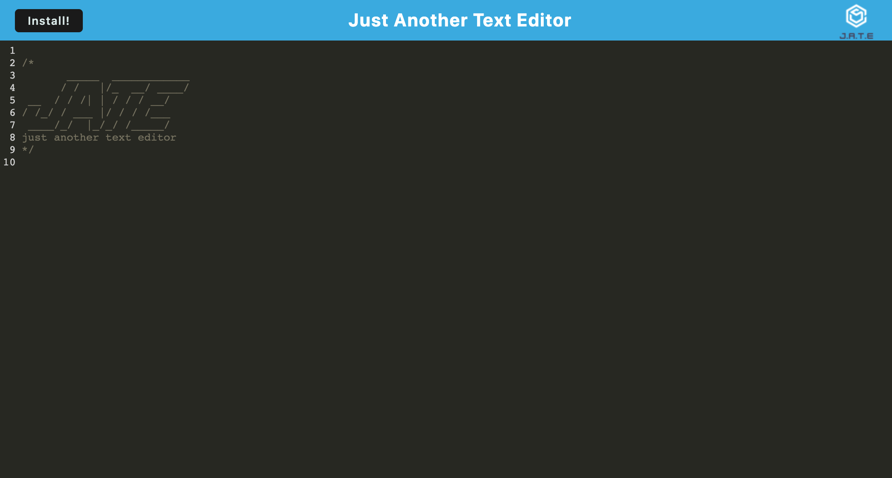

# PWA-Text-Editor
## Description
This application creates a text editor named JATE (Just another text editor). It uses local storage to save and retrieve user data. It also uses webpack, data caching, 
workbox services and IndexDB to optimize loading speed.
The caching feature allows this application to still run offline in the browser. This app also doubles as a Progressive Web Application and can be run the users desktop.

## Visuals

## Deployed Links

* [The URL of the deployed application.](https://whispering-river-74182.herokuapp.com/)

* [The URL of the GitHub repository.](https://github.com/simone188535/PWA-Text-Editor)